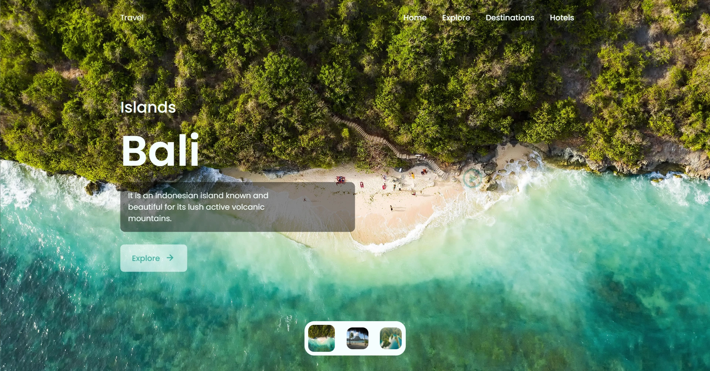

<div align="center">
    <a href="https://bg-img-slider-1.netlify.app" target="_blank">
      
    </a>
  <h3 align="center">Background Image Slider #1</h3>
</div>

##  <br /> 📋 <a name="table">Table of Contents</a>

- ✨ [Introduction](#introduction)
- ⚙️ [Tech Stack](#tech-stack)
- 🚀 [Quick Start](#quick-start)

##  <br /> <a name="introduction">✨ Introduction</a>

**[EN]** Landing page design featuring a stunning image background slider and paradise islands theme. Created using HTML, CSS, and JavaScript, with smooth transitions and engaging visuals to captivate visitors. Dynamic animations created with GSAP and interactive slider powered by Swiper.js.

**[FR]** Conception de page de destination avec un diaporama d'images en arrière-plan et un thème d'îles paradisiaques. Réalisée en HTML, CSS et JavaScript, avec des transitions fluides et des visuels captivants pour attirer les visiteurs. Animations dynamiques créées avec GSAP et diaporama interactif optimisé par Swiper.js.

##  <br /> <a name="tech-stack">⚙️ Tech Stack</a>

- HTML
- CSS
- JavaScript
  
- **Sass** is a powerful CSS preprocessor that extends the capabilities of CSS with features like variables, nested rules, mixins, and functions. It helps in writing more maintainable and reusable CSS code by allowing for a more structured and organized approach to styling. Sass files are compiled into regular CSS before being served to the browser.
  
- **GSAP** (GreenSock Animation Platform) is a robust JavaScript library for creating high-performance animations. It allows developers to animate any object on the web with precise control over timing, sequences, and interactions. GSAP is known for its speed, reliability, and rich feature set, making it a go-to choice for professional animators and developers.
  
- **Swiper.js** is a modern, free, mobile touch slider with hardware-accelerated transitions. It is used to create responsive, swipeable sliders and carousels with a wide range of customization options. Swiper.js supports various transition effects, navigation controls, and is compatible with all major web browsers and mobile platforms.

## <br /> <a name="quick-start">🚀 Quick Start</a>

Follow these steps to set up the project locally on your machine.

<br/>**Prerequisites**

Make sure you have the following installed on your machine:

- [Git](https://git-scm.com/)
- [Node.js](https://nodejs.org/en)
- [npm](https://www.npmjs.com/) (Node Package Manager)

<br/>**Cloning the Repository**

```bash
git clone {git remote URL}
```

<br/>**Running the Project**

Use [Live Server](https://marketplace.visualstudio.com/items?itemName=ritwickdey.LiveServer)
to launch a development local server with live reload feature for static & dynamic pages.